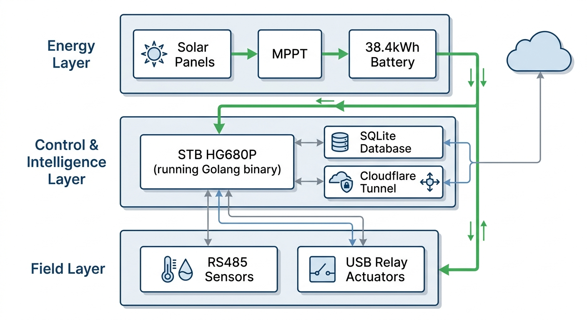
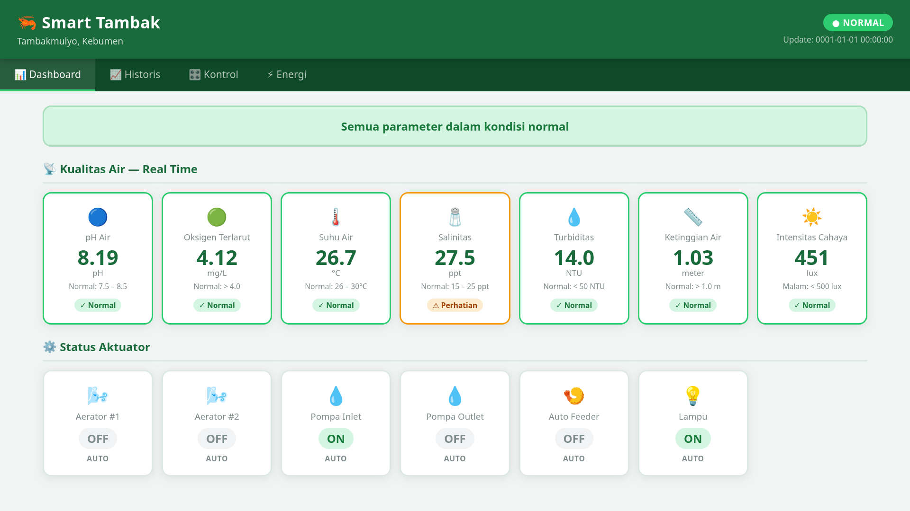
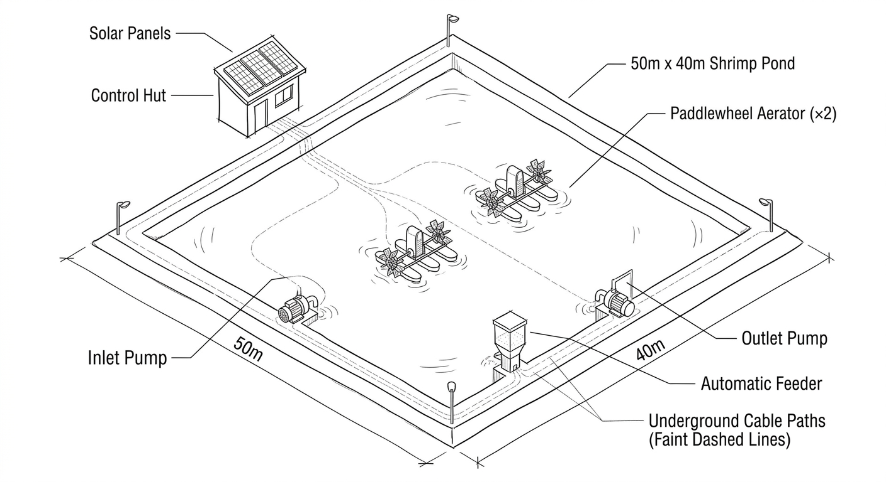
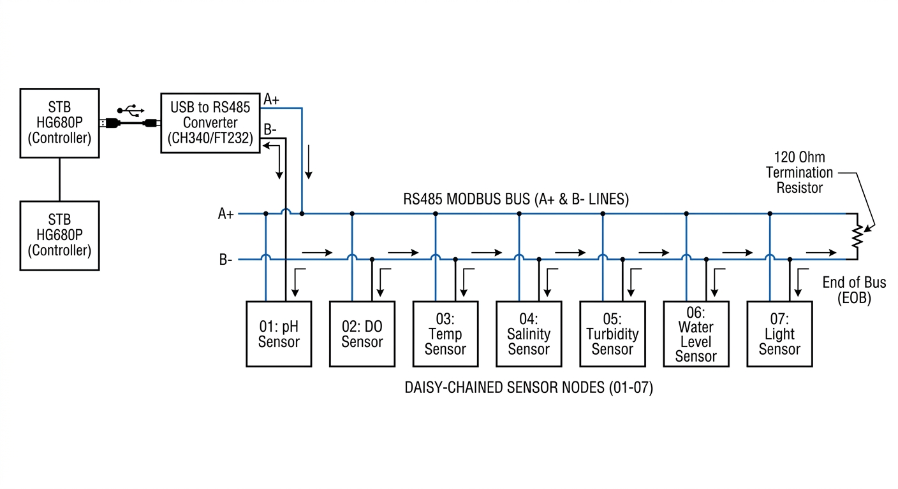
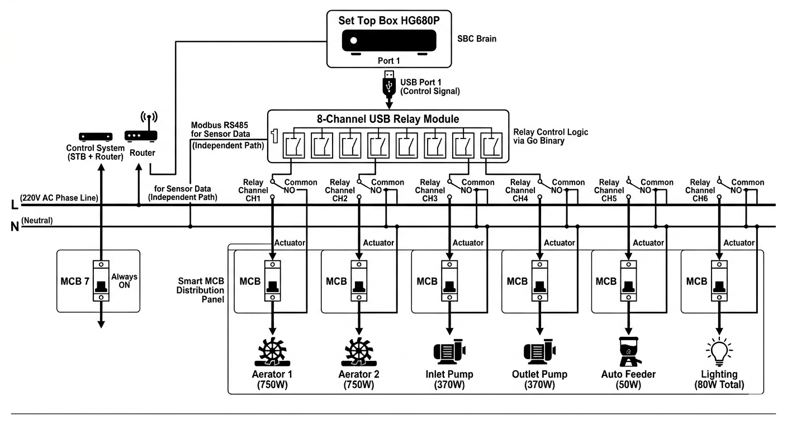
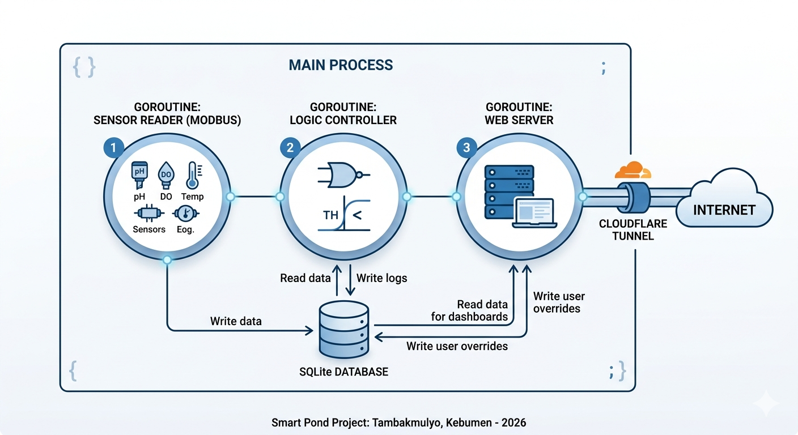
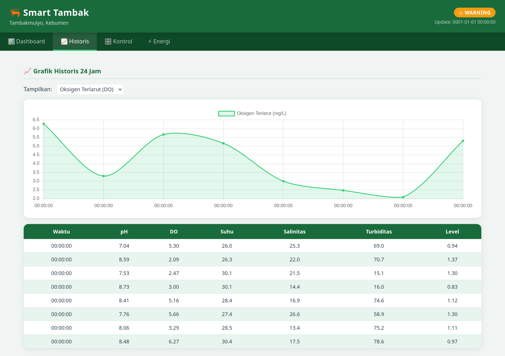
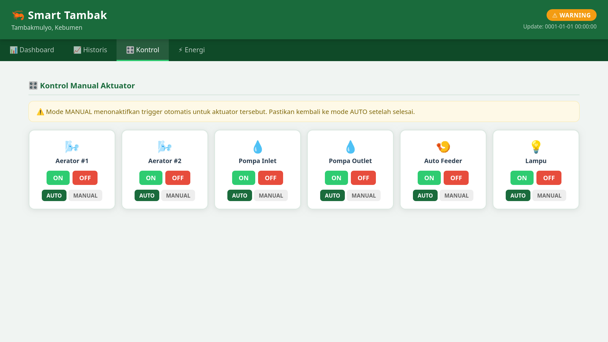
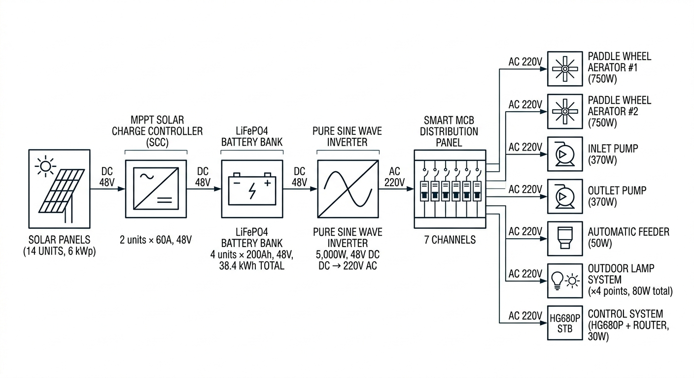
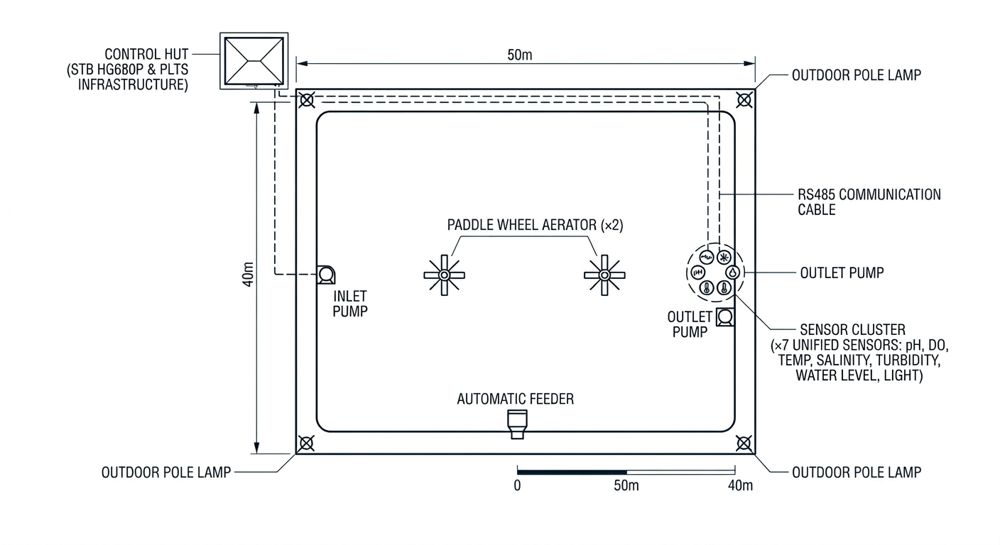

# 🦐 Smart Shrimp Pond — IoT & Solar Panel-Based Control System

> **Innovation of IoT and Solar Panel-Based Shrimp Pond Control System**
> in the Coastal Area of Kebumen, Central Java, Indonesia

[](https://go.dev)
[](https://sqlite.org)
[](https://armbian.com)
[](https://cloudflare.com)
[](LICENSE)
[](https://github.com/sufiarh/sistem-smart-tambak)

---

## 📸 Preview


*Figure 1 — Full System Block Diagram: 3 Integrated Layers (Energy → Control → Field)*


*Figure 2 — Real-Time Monitoring Dashboard on Smartphone via Cloudflare Tunnel*

---

## 🌟 About This Project

**Smart Shrimp Pond** is an intelligent Pacific white shrimp (*Litopenaeus vannamei*) pond control system that integrates:

- ☀️ **6 kWp Solar Power System (SPS)** — fully off-grid, zero PLN dependency
- 🌐 **Internet of Things (IoT)** — real-time monitoring & control from anywhere in the world
- 🧠 **STB HG680P** running Armbian Linux as the system brain — innovative & affordable
- 📡 **7 RS485 Modbus Sensors** — continuous 24/7 automated water quality monitoring
- ⚡ **Threshold-Based Trigger Control** — truly smart, not just a timer

Developed as a real-world solution for shrimp farmers in **Tambakmulyo, Kebumen, Central Java** who still rely on conventional and manual pond management.

---

## 🏗️ System Architecture


*Figure 3 — 3D Isometric Macro View: Control House, Solar Panels, Pond, Sensors & Actuators*

The system is built on **3 main layers:**

```
☀️  LAYER 1 — ENERGY
    Solar Panels (6 kWp) → MPPT SCC → LiFePO4 Battery (38.4 kWh)
    → Pure Sine Wave Inverter → AC 220V to all devices

🧠  LAYER 2 — CONTROL (Control House)
    HG680P (Go Binary)
    ├── USB Port 1: USB Relay Module 8CH → controls 6 actuators (MCB)
    └── USB Port 2: USB to RS485 Converter → reads 7 RS485 sensors

🌊  LAYER 3 — FIELD (50m × 40m Pond)
    7 RS485 Sensors (daisy-chain) → data → HG680P every 5 seconds
    HG680P → trigger logic → USB Relay → actuators ON/OFF
```

---

## ✨ Key Features

| Feature | Description |
|---|---|
| 🌞 **Off-Grid Solar Power** | 14× monocrystalline panels 430Wp + LiFePO4 battery bank |
| 📡 **Real-Time Monitoring** | pH, DO, Temperature, Salinity, Turbidity, Water Level, Light |
| 🤖 **Automatic Control** | Aerators, inlet/outlet pumps, feeder, lighting — threshold-triggered |
| 💻 **Web Dashboard** | Access via smartphone through personal domain + Cloudflare Tunnel |
| 🔐 **Authentication** | Password login + 7-day cookie session |
| 📊 **Historical Charts** | 24-hour sensor trend — per-hour SQL aggregation via SQLite |
| 🎛️ **Manual Override** | Toggle AUTO/MANUAL mode per actuator from dashboard |
| 💡 **Hardware Innovation** | Affordable STB HG680P (~USD 15) converted into Linux SBC |

---

## 🗂️ Project Structure

```
smart-tambak/
│
├── main.go                  # Entry point — initialize & launch 3 goroutines
├── go.mod                   # Go module & dependencies
├── go.sum                   # Dependency checksum
├── config.yaml              # Thresholds, schedules, USB ports, sensor addresses
├── install.sh               # Automated installation script for Armbian Linux
├── smart-tambak.service     # Systemd autostart service on boot
│
├── documentations/
│   ├── full technical documentation.pdf
│
├── core/
│   ├── sensor.go            # Structs, Modbus RTU, RS485 reading goroutine
│   ├── controller.go        # Threshold trigger logic for all actuators
│   ├── relay.go             # USB HID — relay channel control CH1–CH6
│   ├── database.go          # SQLite — connection, migration, save & retrieve + Config struct
│   └── server.go            # Web server, routes, handlers, REST API, auth middleware
│
├── web/
│   ├── index.html           # Single Page App — 4-tab dashboard
│   ├── style.css            # Full dashboard styling
│   └── app.js               # Sensor polling, Chart.js graphs, relay control
│
└── images/                  # Project diagrams & screenshots (for README)
```

---

## 🚀 Quick Start

### Production Mode (STB HG680P — Armbian Linux)

```bash
# 1. Install Go for ARM64
wget https://go.dev/dl/go1.22.4.linux-arm64.tar.gz
sudo tar -C /usr/local -xzf go1.22.4.linux-arm64.tar.gz
echo 'export PATH=$PATH:/usr/local/go/bin' >> ~/.bashrc && source ~/.bashrc

# 2. Install system dependencies
sudo apt update && sudo apt install sqlite3 libsqlite3-dev git curl

# 3. Install Cloudflare Tunnel
wget https://github.com/cloudflare/cloudflared/releases/latest/download/cloudflared-linux-arm64
chmod +x cloudflared-linux-arm64
sudo mv cloudflared-linux-arm64 /usr/local/bin/cloudflared
cloudflared tunnel login

# 4. Clone, configure & build
git clone https://github.com/sufiarh/sistem-smart-tambak
cd sistem-smart-tambak
go mod tidy
# Edit config.yaml → simulation: false
go build -o smart-tambak main.go

# 5. Enable autostart on boot
sudo cp smart-tambak.service /etc/systemd/system/
sudo systemctl enable smart-tambak && sudo systemctl start smart-tambak
```

> 💡 **Cross-compile from laptop to HG680P:**
> ```bash
> GOARCH=arm64 GOOS=linux go build -o smart-tambak main.go
> # Copy binary to HG680P — runs without installing Go on the device
> ```

---

## 📡 Sensors & Actuators

### RS485 Sensor Network — Daisy-Chain Configuration


*Figure 4 — All 7 Sensors Connected in Series on a Single RS485 Cable*

| Sensor | RS485 Address | Measures | Normal Threshold |
|---|---|---|---|
| pH Sensor | `01` | Water acidity | 7.5 – 8.5 |
| DO Sensor | `02` | Dissolved oxygen | ≥ 4.0 mg/L |
| Temperature Sensor | `03` | Water temperature | 26 – 30°C |
| Salinity/EC Sensor | `04` | Salt concentration | 15 – 25 ppt |
| Turbidity Sensor | `05` | Water clarity | < 50 NTU |
| Water Level Sensor | `06` | Pond water height | ≥ 1.0 meter |
| Light Sensor | `07` | Ambient light intensity | Day / Night |

### Actuators — Trigger-Based Control Logic


*Figure 5 — Complete Control Wiring: HG680P → USB Relay → Smart MCB → Actuators*

| Actuator | Relay Ch. | MCB | Power | Trigger Logic |
|---|---|---|---|---|
| Paddle Wheel Aerator #1 | CH1 | MCB 1 | 750W | DO < 4.0 mg/L → ON &#124; DO > 5.5 mg/L → OFF |
| Paddle Wheel Aerator #2 | CH2 | MCB 2 | 750W | Same as Aerator #1 (simultaneous) |
| Inlet Water Pump | CH3 | MCB 3 | 370W | pH abnormal &#124; Salinity > 25 ppt &#124; Level < 1m → ON |
| Outlet Water Pump | CH4 | MCB 4 | 370W | Turbidity > 50 NTU → ON &#124; < 20 NTU → OFF |
| Auto Feeder | CH5 | MCB 5 | 50W | Schedule 07:00/12:00/17:00 + DO ≥ 4.0 → ON 30 sec |
| Lighting System | CH6 | MCB 6 | 80W | Light < 500 lux → ON &#124; ≥ 500 lux → OFF |

---

## 🧠 Software Architecture


*Figure 6 — Go Software Architecture: 3 Parallel Goroutines + SQLite + Cloudflare Tunnel*

```
┌──────────────────────────────────────────────────┐
│             STB HG680P — Go Binary               │
│                                                  │
│  Goroutine 1 — Sensor Reader                     │
│  → Reads 7 RS485 sensors every 5 seconds         │
│  → Saves all readings to SQLite with timestamp   │
│                      ↕ SQLite                    │
│  Goroutine 2 — Controller                        │
│  → Reads latest sensor data from SQLite          │
│  → Compares values against thresholds            │
│  → Sends ON/OFF commands to USB Relay Module     │
│                      ↕ SQLite                    │
│  Goroutine 3 — Web Server (port 8080)            │
│  → Serves real-time dashboard (HTML/JS)          │
│  → REST API for sensor data & relay control      │
│  → Password authentication middleware            │
│                                                  │
│  [Cloudflare Tunnel] ──→ yourdomain.com (HTTPS)  │
└──────────────────────────────────────────────────┘
     USB Port 1 ──→ USB Relay Module 8 Channel
     USB Port 2 ──→ USB to RS485 Converter
```

---

## 💻 Dashboard


*Figure 7 — Main Dashboard: Sensor Values, System Status Indicator & Actuator States*


*Figure 8 — Historical Data: 24-Hour Sensor Trend Charts (Per-Hour Aggregation)*


*Figure 9 — Manual Control: AUTO/MANUAL Toggle + ON/OFF Per Actuator*

The dashboard is a **Single Page App** with 4 tabs:

| Tab | Content |
|---|---|
| 📊 **Dashboard** | 7 sensor values real-time + actuator status + Green/Yellow/Red indicator |
| 📈 **Historical** | 24-hour trend charts (per-hour SQL aggregation) + last 50 records table |
| 🎛️ **Control** | AUTO/MANUAL mode toggle + manual ON/OFF relay control per actuator |
| ⚡ **Energy** | SPS capacity info, daily consumption estimate, battery specification |

---

## ☀️ Solar Power System


*Figure 10 — SPS Schematic: Panel → MPPT SCC → LiFePO4 Battery → Inverter → MCB Panel*

| Component | Specification | Function |
|---|---|---|
| Solar Panels | 14× monocrystalline 430Wp, 48V | Convert sunlight to DC electricity |
| MPPT SCC | 2× 60A, 48V | Optimized charging (20–30% better than PWM) |
| LiFePO4 Battery | 4× 200Ah 48V = **38.4 kWh** | Energy storage — 2-night backup |
| Pure Sine Wave Inverter | 5,000W 48V DC → 220V AC | Clean power for all equipment |
| Smart MCB Panel | 7 independently controlled channels | Power distribution per actuator |

---

## ⚙️ Configuration

All parameters are controlled from `config.yaml` — no code changes needed.

```yaml
app:
  simulation: true          # true = dev mode | false = HG680P production

hardware:
  rs485_port: "/dev/ttyUSB0"
  rs485_baudrate: 9600
  relay_vendor_id: 0x16c0
  relay_product_id: 0x05df

threshold:
  do_aerator_on: 4.0        # DO below this → aerators ON
  do_aerator_off: 5.5       # DO above this → aerators OFF
  ph_min: 7.5
  ph_max: 8.5
  salinity_max: 25.0
  water_level_min: 1.0
  turbidity_on: 50.0
  turbidity_off: 20.0
  light_threshold: 500      # Lux below this → lights ON

feeder:
  duration_seconds: 30
  schedules: ["07:00", "12:00", "17:00"]
```

---

## 🗺️ Study Case


*Figure 11 — Top-View Layout: 50m × 40m Pond with All Component Positions*

| Parameter | Value |
|---|---|
| 📍 Location | Tambakmulyo, Kebumen, Central Java, Indonesia |
| 📐 Pond Size | 50m × 40m = 2,000 m² |
| 💧 Water Depth | 1.2 – 1.5 meters |
| 🦐 Capacity | ±100,000 Pacific white shrimp |
| ⚡ Energy | 6 kWp SPS — fully off-grid |
| 🧠 System Brain | STB HG680P (Armbian Linux) |

---

## 🔍 Troubleshooting

<details>
<summary><b>Sensor not detected</b></summary>

```bash
dmesg | grep ttyUSB        # Should show: ch341-uart converter
ls /dev/ttyUSB*            # Should show: /dev/ttyUSB0
```
- Verify RS485 wiring: A+ and B- must not be swapped
- Check sensor Modbus addresses match `config.yaml`

</details>

<details>
<summary><b>USB Relay not responding</b></summary>

```bash
lsusb                               # Look for: ID 16c0:05df
sudo usermod -a -G dialout $USER    # Grant USB access, then re-login
```

</details>

<details>
<summary><b>Dashboard not accessible from outside</b></summary>

```bash
systemctl status cloudflared    # Check tunnel service
ping 8.8.8.8                    # Check internet on HG680P
cloudflared tunnel list         # Verify tunnel is active
```

</details>

<details>
<summary><b>Historical chart shows 00:00 timestamps</b></summary>

Stale database from previous session. Fix:
```bash
rm data/tambak.db && go run main.go
```

</details>

---

## 👥 Research & Development

<table>
  <tr>
    <td align="center" width="50%">
      <br/>
      <b>Sufi Anugrah</b>
      <br/><br/>
      Hardware Architecture & System Design<br/>
      IoT Integration & Solar Power Planning<br/>
      Go Backend & Dashboard Development
    </td>
    <td align="center" width="50%">
      <br/>
      <b>Abu Yazid Bustomi</b>
      <br/><br/>
      Scientific Paper Writing & Analysis<br/>
      Literature Review & Research<br/>
      Data Analysis & Documentation
    </td>
  </tr>
</table>

---

## 🏆 Competition

<div align="center">

**Central Java Youth Sustainability Competition 2026**

| | |
|---|---|
| 📋 Category | Scientific Paper (KTI) |
| 🌱 Theme | Energy Transition & Climate Action |
| 🗓️ Registration | April 23 – May 23, 2026 |
| 🏅 Grand Final | June 20, 2026 |

</div>

---

## 📄 License

MIT License — free to use, modify, and distribute with attribution. See [LICENSE](LICENSE).

---

<div align="center">

**Smart Shrimp Pond** — Technology Innovation for Sustainable Aquaculture 🦐☀️

*Tambakmulyo, Kebumen, Central Java, Indonesia | 2026*

⭐ **Star this repo if you find it useful!**

</div>
